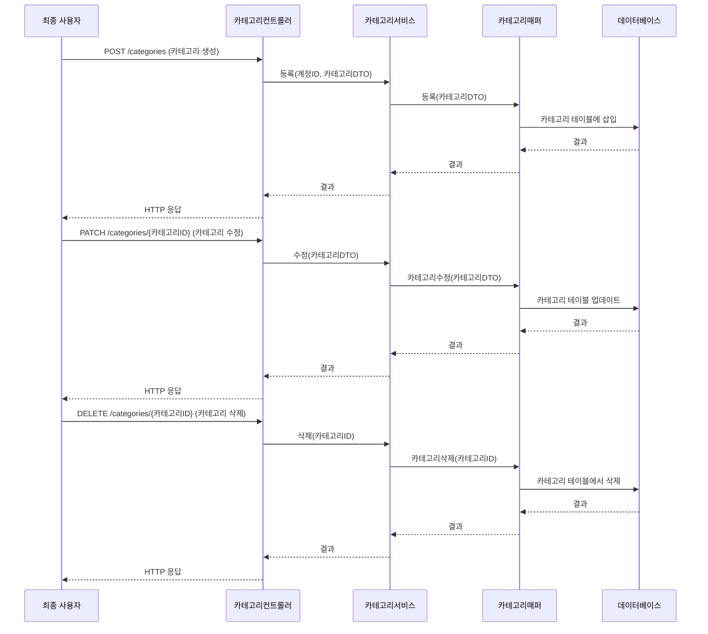
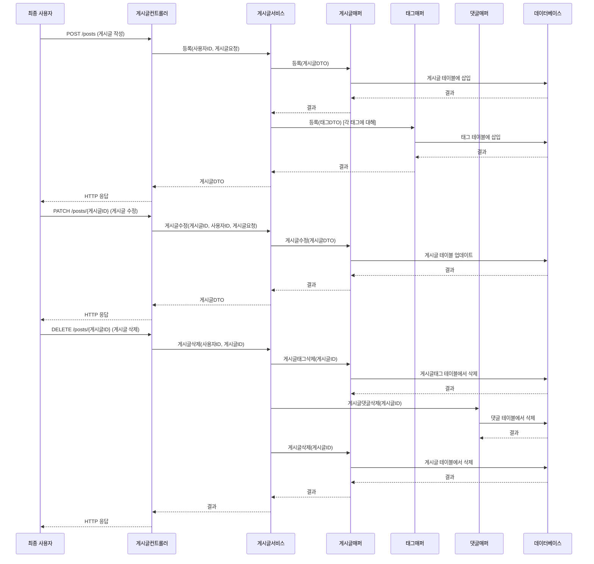
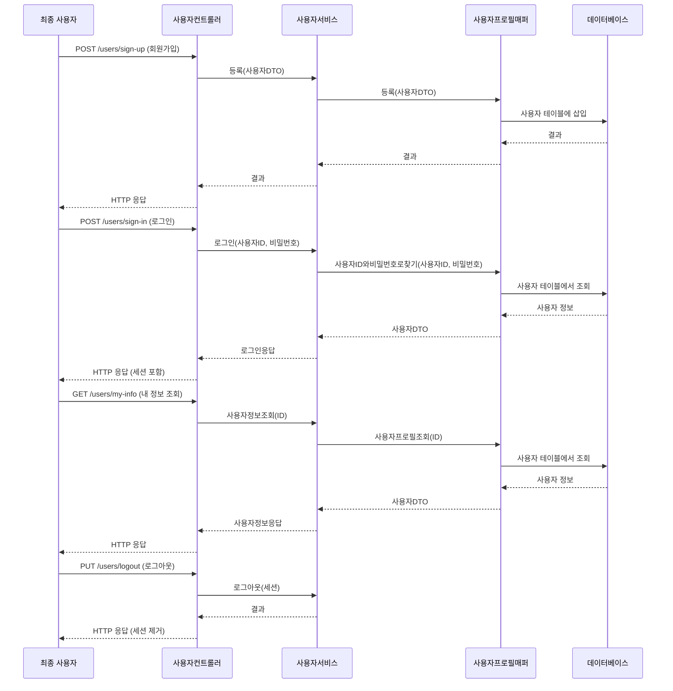
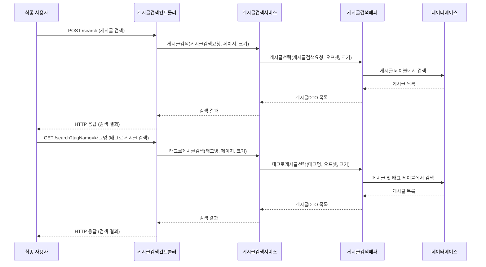
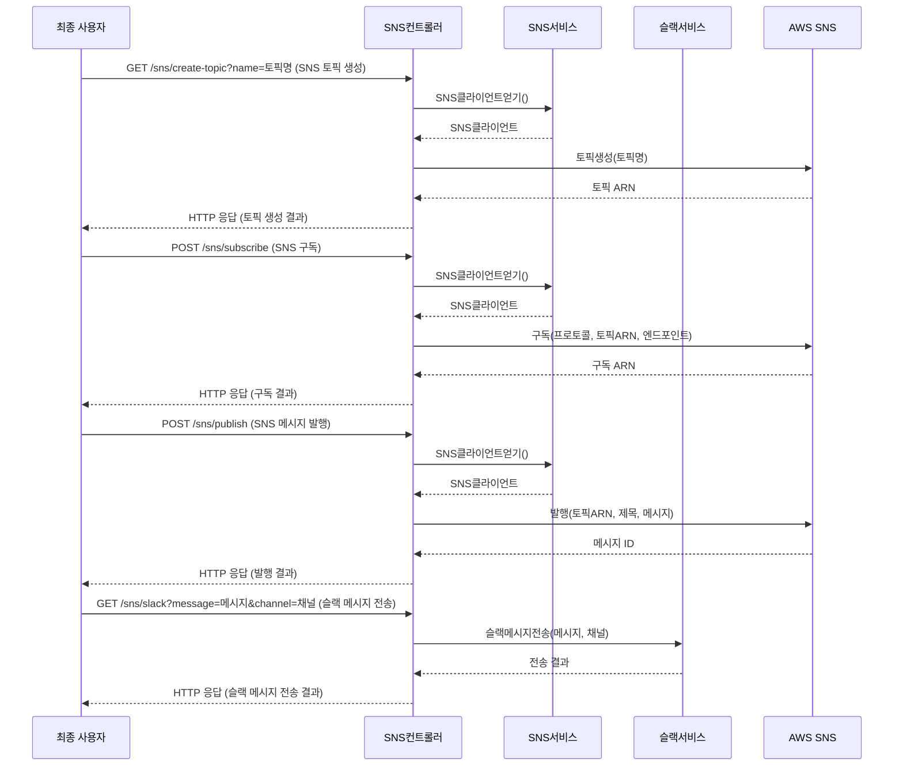
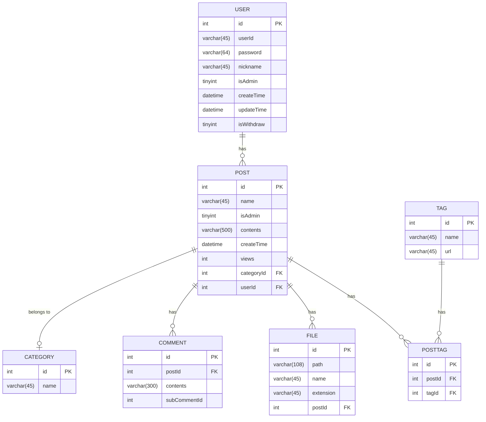

### 프로젝트 이름: **게시판 시스템**

## 소개
이 프로젝트는 **대규모 트래픽을 처리할 수 있는 게시판 시스템**을 개발하는 것을 목표로 하고 있습니다. 사용자 인증, 게시글 작성, 수정, 삭제, 댓글 및 태그 관리, 캐시 시스템을 활용한 검색 기능 등을 구현하였습니다. **Spring Boot**와 **MyBatis**를 기반으로 하며, **Redis** 및 **MySQL**을 연동하여 성능을 최적화했습니다.

## 주요 기능
- **게시글 관리**: CRUD(Create, Read, Update, Delete) 기능 제공
- **댓글 기능**: 게시글에 대한 댓글 작성, 수정, 삭제
- **태그 관리**: 게시글에 태그 추가, 수정, 삭제
- **검색 기능**: Redis 캐시를 활용한 빠른 게시글 검색
- **API 구성**: RESTful API 제공

## 설치 및 실행

### 1. 의존성 설치
프로젝트 실행을 위해 아래와 같은 의존성이 필요합니다:

- **Java 11** 이상
- **Maven** 혹은 **Gradle**
- **Docker** (MySQL, Redis, Jenkins 사용)

### 2. 데이터베이스 및 캐시 설정

게시판 시스템은 **MySQL**과 **Redis**를 사용합니다. 이를 Docker Compose를 통해 실행할 수 있습니다.

#### MySQL & Redis 실행 (Docker Compose)
```bash
docker-compose up -d
```

```yaml
version: '3.8'
services:
  mysql:
    image: mysql:8.0
    container_name: mysql_db
    environment:
      MYSQL_ROOT_PASSWORD: root
      MYSQL_DATABASE: board_db
    ports:
      - "3306:3306"
    volumes:
      - ./mysql_data:/var/lib/mysql

  redis:
    image: redis:alpine
    container_name: redis_cache
    ports:
      - "6379:6379"
    volumes:
      - ./redis_data:/data
```

### 3. Jenkins 설정
CI/CD 파이프라인을 자동화하기 위해 **Jenkins**를 Docker로 설정할 수 있습니다.

```bash
docker-compose up -d jenkins
```

```yaml
  jenkins:
    image: jenkins/jenkins:lts
    container_name: jenkins
    ports:
      - "8081:8080"
      - "50000:50000"
    volumes:
      - ./jenkins_home:/var/jenkins_home
```

### 4. 애플리케이션 실행

```bash
# Maven 실행
mvn spring-boot:run

# 혹은 Gradle 실행
./gradlew bootRun
```

### 5. API 문서
- **Postman**를 통해 API 문서를 제공합니다. `https://documenter.getpostman.com/view/14042841/2sAXjRWVTN` 접속하여 API 명세를 확인할 수 있습니다.

## 사용 예시
게시글 조회 API를 호출하는 예시:
```bash
curl -X GET "http://localhost:8080/posts"

```

## 기여 방법
1. 이 레포지토리를 포크하세요.
2. 새로운 브랜치를 생성하세요: `git checkout -b feature/your-feature`
3. 변경사항을 커밋하세요: `git commit -m 'Add some feature'`
4. 브랜치에 푸시하세요: `git push origin feature/your-feature`
5. 풀 리퀘스트를 생성하세요.

## 흐름도 
## 카테고리 API 흐름도


### 설명

카테고리컨트롤러는 카테고리의 생성, 수정, 삭제 기능을 담당합니다.

- 카테고리 생성 (POST /categories): 새로운 카테고리를 생성합니다.
- 카테고리 수정 (PATCH /categories/{카테고리ID}): 기존 카테고리의 정보를 수정합니다.
- 카테고리 삭제 (DELETE /categories/{카테고리ID}): 특정 카테고리를 삭제합니다.

---

## POST API 흐름도



### 설명

게시글컨트롤러는 게시글의 작성, 수정, 삭제 기능을 담당합니다.

- 게시글 작성 (POST /posts): 새로운 게시글을 작성하고, 관련된 태그도 함께 저장합니다.
- 게시글 수정 (PATCH /posts/{게시글ID}): 기존 게시글의 내용을 수정합니다.
- 게시글 삭제 (DELETE /posts/{게시글ID}): 게시글을 삭제하며, 관련된 태그와 댓글도 함께 삭제합니다.

## 유저 API 흐름도


사용자컨트롤러는 사용자 관리와 관련된 기능을 담당합니다.

- 회원가입 (POST /users/sign-up): 새로운 사용자를 등록합니다.
- 로그인 (POST /users/sign-in): 사용자 인증을 수행하고 세션을 생성합니다.
- 내 정보 조회 (GET /users/my-info): 로그인한 사용자의 정보를 조회합니다.
- 로그아웃 (PUT /users/logout): 사용자 세션을 종료합니다.

## 게시판 검색 API 흐름도


게시글검색컨트롤러는 게시글 검색 기능을 담당합니다.

- 게시글 검색 (POST /search): 다양한 조건으로 게시글을 검색합니다.
- 태그로 게시글 검색 (GET /search?tagName=태그명): 특정 태그가 포함된 게시글을 검색합니다.

## SNS API 흐름도


1. SNS 토픽 생성 (GET /sns/create-topic?name=토픽명):
    - 새로운 SNS 토픽을 생성합니다.
    - SNS 서비스를 통해 AWS SNS와 통신하여 토픽을 생성하고 토픽 ARN을 반환받습니다.
2. SNS 구독 (POST /sns/subscribe):
    - 특정 토픽에 대한 구독을 생성합니다.
    - 프로토콜(예: HTTP, HTTPS, Email 등), 토픽 ARN, 엔드포인트를 지정하여 구독을 설정합니다.
3. SNS 메시지 발행 (POST /sns/publish):
    - 지정된 토픽에 메시지를 발행합니다.
    - 토픽 ARN, 제목, 메시지 내용을 포함하여 AWS SNS에 메시지를 전송합니다.
4. Slack 메시지 전송 (GET /sns/slack?message=메시지&channel=채널):
    - Slack 채널에 메시지를 전송합니다.
    - 슬랙서비스를 통해 지정된 채널에 메시지를 보냅니다.

이 컨트롤러는 SNS 서비스와 슬랙 서비스를 활용하여 알림 및 메시징 기능을 구현합니다. AWS SNS를 사용하여 다양한 구독자에게 메시지를 전달하고, Slack 통합을 통해 팀 커뮤니케이션을 지원합니다.

---

##  ERD 흐름도


###  설명

ERD는 데이터베이스 구조를 시각적으로 표현한 다이어그램으로, 데이터베이스 설계 시 필수적인 도구입니다. 첨부된 ERD는 웹 게시판 시스템의 구조를 나타내고 있습니다. 이 시스템은 사용자(`USER`), 게시글(`POST`), 카테고리(`CATEGORY`), 파일(`FILE`), 댓글(`COMMENT`), 태그(`TAG`), 그리고 게시글과 태그 간의 다대다 관계를 표현하는 `POSTTAG` 테이블로 구성되어 있습니다. 각 테이블은 고유의 식별자(`PK`)와 다른 테이블과의 관계를 나타내는 외래 키(`FK`)를 포함합니다.

### 주요 엔터티 설명:

1. **USER**: 사용자의 정보를 저장하는 테이블입니다. 사용자 ID, 비밀번호, 닉네임, 관리자 여부, 생성 시간, 탈퇴 여부 등의 필드를 포함합니다. 각 사용자는 여러 게시글을 작성할 수 있으므로 `POST` 테이블과 일대다 관계를 가집니다.

2. **POST**: 게시글의 정보를 저장합니다. 게시글의 제목, 내용, 작성 시간, 조회수, 카테고리 ID, 작성자 ID 등이 포함됩니다. 각 게시글은 하나의 카테고리에 속하고, 여러 개의 파일이나 댓글을 가질 수 있습니다. 또한, `POSTTAG` 테이블을 통해 여러 태그와 연결될 수 있습니다.

3. **CATEGORY**: 게시글의 카테고리를 관리하는 테이블입니다. 예를 들어, "공지사항", "자유게시판" 등과 같은 카테고리가 여기에 포함됩니다. 각 카테고리는 여러 게시글에 사용될 수 있습니다.

4. **FILE**: 게시글에 첨부된 파일 정보를 저장하는 테이블입니다. 파일의 경로, 이름, 확장자 등이 저장되며, 각 파일은 특정 게시글에 속합니다.

5. **COMMENT**: 게시글에 달린 댓글을 저장하는 테이블입니다. 각 댓글은 특정 게시글에 속하며, 댓글 내용과 작성 시간이 저장됩니다.

6. **TAG**: 태그 정보를 저장하는 테이블입니다. 태그는 게시글에 연관된 키워드로, 여러 게시글에 동일한 태그가 사용될 수 있습니다.

7. **POSTTAG**: 게시글과 태그 간의 다대다 관계를 표현하는 조인 테이블입니다. 각 게시글은 여러 태그를 가질 수 있고, 각 태그는 여러 게시글에 사용될 수 있습니다.

### 관계 설명:

- **USER와 POST**: 사용자와 게시글 간의 관계는 일대다 관계로, 하나의 사용자가 여러 게시글을 작성할 수 있습니다.
- **POST와 CATEGORY**: 게시글과 카테고리 간의 관계는 다대일 관계로, 하나의 게시글은 하나의 카테고리에 속합니다.
- **POST와 FILE**: 게시글과 파일 간의 관계는 일대다 관계로, 하나의 게시글에 여러 파일을 첨부할 수 있습니다.
- **POST와 COMMENT**: 게시글과 댓글 간의 관계도 일대다 관계로, 하나의 게시글에 여러 댓글이 달릴 수 있습니다.
- **POST와 TAG (POSTTAG를 통해)**: 게시글과 태그 간의 관계는 다대다 관계로, 이를 나타내기 위해 중간에 `POSTTAG` 테이블이 존재합니다.

## 라이센스
이 프로젝트는 MIT 라이센스에 따라 배포됩니다. [LICENSE](LICENSE) 파일을 참조하세요.

## 추가 정보
- 공식 문서 및 상세한 API 정보는 [Wiki](https://github.com/hyeseong-dev/board-server/wiki)에서 확인 가능합니다.
